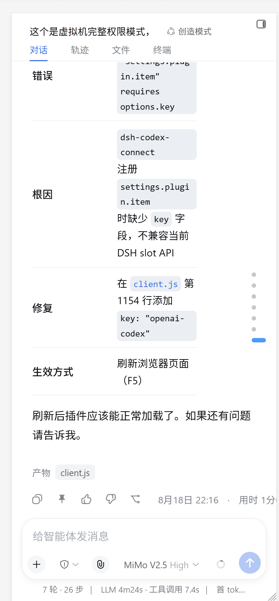
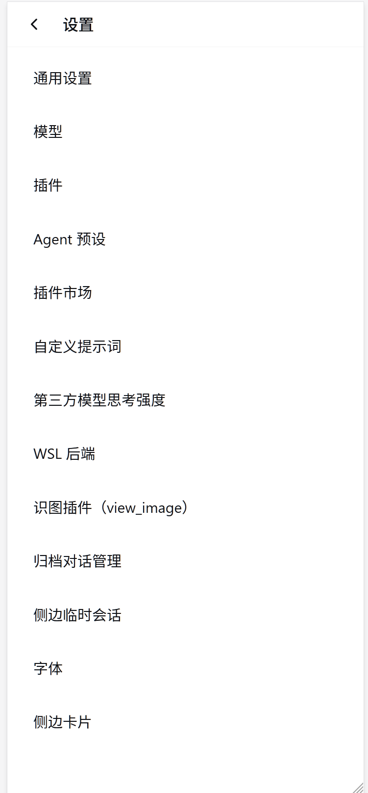
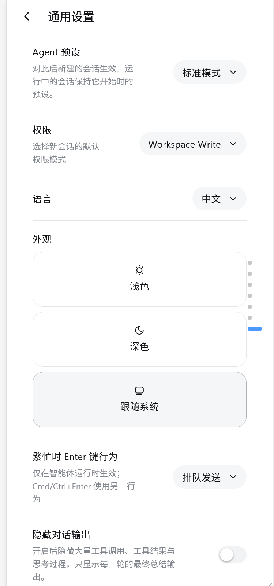
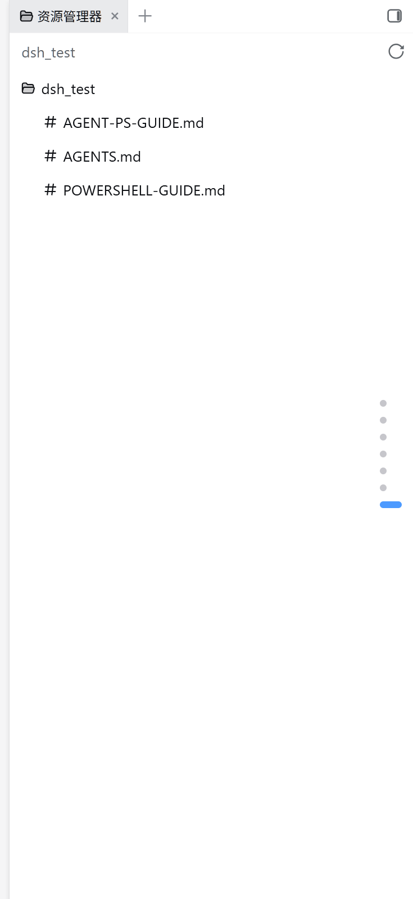

# DSH Mobile UI Layout

[](LICENSE)
[](https://github.com/RyzeZhou/dsh-ui-mobile-layout/stargazers)

[简体中文](https://github.com/RyzeZhou/dsh-ui-mobile-layout/blob/main/README.md)

Make DeepSeek Harness actually usable on a phone: on narrow viewports the desktop
three-column frame is reflowed into a single column + a left drawer, and the
official Settings panel becomes a **native two-level mobile settings screen** —
tap the settings entry for a fullscreen list of items → tap an item for that
item's settings page → back arrow on every level. Desktop stays completely
untouched.

[Features](#features) · [Prerequisites](#prerequisites) · [Installation](#installation) ·
[Usage](#usage) · [Notes & plugin conflicts](#notes--plugin-conflicts) ·
[Update & uninstall](#update--uninstall) · [How it works](#how-it-works)

If this helps you, feel free to hit **Star** at the top of the
[repository](https://github.com/RyzeZhou/dsh-ui-mobile-layout).

## Preview

<table>
  <tr>
    <td></td>
    <td></td>
    <td></td>
  </tr>
  <tr align="center">
    <td>Conversation</td>
    <td>Settings list</td>
    <td>Item detail</td>
  </tr>
</table>

The left drawer, sidebar and file manager panels also work on mobile:

<p align="center">
  <br>
  Sidebar (file manager) works normally on mobile
</p>

## Features

- **Single-column layout** on phones: the nav rail becomes a left drawer (slides
  with `left`, not `transform`), the conversation area fills the screen.
- **Native mobile settings UI**: the Settings panel becomes fullscreen with a
  two-level navigation (settings → item list → item page), matching iOS/Android
  settings conventions.
- **Title follows the item**: the top title shows the name of the item you opened.
- **Fully interactive detail pages**: toggles/sliders inside an item all work
  natively (reuses the official React rendering — nothing is cloned).
- **Large touch targets**: top back button and list rows are ≥44px touch areas.
- **Safe-area aware**: respects `safe-area-inset` for notches / gesture bars.
- **Zero desktop regression**: no mobile styles are injected above 767px.

## Prerequisites

- DeepSeek Harness `0.1.0-rc.6` / `0.1.0-rc.7` (desktop build or official CLI).
- It is recommended to verify on a separate test instance first.

> This plugin is a **client bundle plugin** (all work happens in the browser). It
> does **not** replace or modify any official slot occupant — it only reflows the
> frame shell on narrow viewports and layers its own fullscreen overlay on top of
> the official Settings panel. Nothing is registered on desktop.

## Installation

### Manual install (Windows, PowerShell)

Put the plugin folder (or the extracted tarball) under the profile `node_modules`,
register it in the profile `package.json`, then restart that instance:

```powershell
# dependencies:
#     "dsh-ui-mobile-layout": "file:./node_modules/dsh-ui-mobile-layout"
# dsh.profile.bundles:
#     "dsh-ui-mobile-layout"
```

Restart to activate:

```powershell
restart-5070.ps1   # or your usual restart script
```

> You can also install via `dsh plugin --profile web add dsh-ui-mobile-layout`
> if your DSH version supports it.

### Install via an Agent

Paste this into your Agent:

```text
Install the dsh-ui-mobile-layout plugin into the DSH web profile:
1. Copy the package to <profile>/node_modules/dsh-ui-mobile-layout
2. In the profile package.json dependencies add "dsh-ui-mobile-layout": "file:./node_modules/dsh-ui-mobile-layout"
3. Add "dsh-ui-mobile-layout" to the dsh.profile.bundles array
4. Restart that instance and verify HTTP 200 and that the plugin appears in the boot graph
```

## Usage

It activates automatically after installation — no switch needed:

1. Open DSH from a phone (or DevTools narrow viewport);
2. Left drawer: swipe from the left edge (or tap the top-left menu button);
3. Tap the settings entry → fullscreen settings list;
4. Tap any item → that item's settings page (title = item name);
5. Back arrow: detail → back to list; list → closes settings.

## Notes & plugin conflicts

> **Important** — this plugin is usable at a *basic-functionality* level. DSH is a
> PC-first React app, so mobile adaptation has boundaries.

- **Verified environment**: tested against the stock official base plugins
  (shell / ui-settings-general / ui-layout etc.). In **that environment**, the
  drawer, two-level settings navigation, and detail interactions all pass.
- **Watch out for other plugin conflicts**: because the implementation overlays
  global frame + official Settings styles/behavior, these plugin types may
  conflict and need per-case verification:
  - other **mobile** reflow plugins (e.g. community `dsh-ui-mobile`-like) — if
    they put a `transform` on the sidebar, they trap fixed dialogs; pick one or
    check cascade order;
  - plugins that **rewrite/replace the official Settings panel** or the
    `role="dialog"` structure;
  - plugins with very high `z-index` fullscreen layers (this plugin's overlay
    uses `z-index:2000`; their layer could cover Settings).
  - When conflicts occur: load this plugin + the conflicting plugin together on a
    separate instance (e.g. a 5070 test bench) first, verify, then apply to your
    daily instance. The drawer intentionally uses `left` instead of `transform`
    to avoid trapping fixed dialogs — **please do not switch it back to
    `transform`**.
- **Regression on DSH upgrades**: if the official SettingsRoot nav/content/close
  structure changes, minor adaptation may be needed (see
  `MOBILE-SETTINGS-FINAL.md` in the repo).

## Update & uninstall

| Action | How |
| --- | --- |
| Update | Replace `node_modules/dsh-ui-mobile-layout` with the new version, restart |
| Uninstall | Keep a copy of the folder → remove the dependency & bundle entry from `package.json` → restart |

## How it works

The core idea behind the two-level mobile settings (full design doc in the repo
at `MOBILE-SETTINGS-FINAL.md`):

```
Narrow viewport (<768px)
├─ frame 3 columns → single column
├─ sidebar → left drawer (left displacement; transform:none so fixed dialogs aren't trapped)
├─ official dialog fullscreen → "detail page" (live content, all controls interactive)
└─ our own body-level overlay → "settings list page"
    ├─ top bar (back button + title)
    ├─ item list (our own buttons, bound via addEventListener — the only reliable
    │            event mechanism in this environment)
    └─ detail state: overlay transparent + pointer-events:none → official live content
```

Why this design? In this environment:
- `document`-level event delegation is unreliable (clicks never reach the
  document layer);
- reparenting / inserting DOM into the React-managed dialog breaks React's
  synthetic events and reconciliation;
- cloning official content produces an event-less static snapshot.

So: **our list uses self-created elements bound directly to click; the detail
page simply exposes the official React live content** — neither path touches the
React tree.

## Structure

```
lib/index.js       host half (minimal; all logic lives in the client)
lib/client.js      client half: CSS injection + overlay / two-level nav / behavior layer
                   (the authoritative source for styles)
mobile.css         mirror of the CSS embedded in client.js (publishing/reading);
                   keep both in sync when changing layout
cordis.patch.yml   plugin loading patch
```

> Note: the CSS embedded in `lib/client.js` is what actually runs in the browser.
> `mobile.css` is a synced mirror for publishing/reading. Change both together.

## License

MIT
